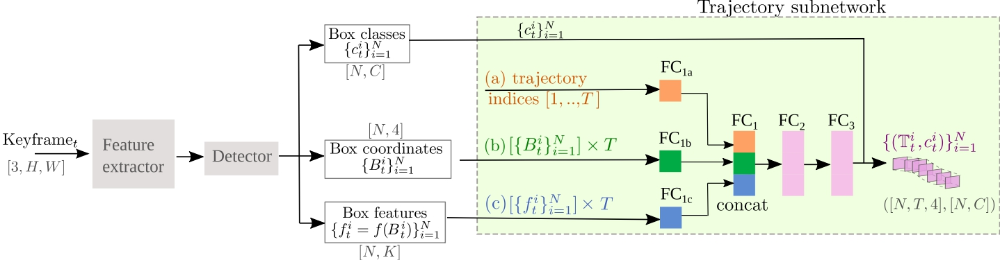

## Objects do not disappear: Video object detection by single-frame object location anticipation (Windows Support)
The windows version official implementation of the ICCV 2023 paper:
[Objects do not disappear: Video object detection by single-frame object location anticipation](https://arxiv.org/abs/2308.04770).

#### Abstract
*Objects in videos are typically characterized by continuous smooth motion. We exploit continuous smooth motion in three ways. 1) Improved accuracy by using object motion as an additional source of supervision, which we obtain by anticipating object locations from a static keyframe. 2) Improved efficiency by only doing the expensive feature computations on a small subset of all frames. Because neighboring video frames are often redundant, we only compute features for a single static keyframe and predict object locations in subsequent frames. 3) Reduced annotation cost, where we only annotate the keyframe and use smooth pseudo-motion between keyframes. We demonstrate computational efficiency, annotation efficiency, and improved mean average precision compared to the state-of-the-art on four datasets: ImageNet VID, EPIC KITCHENS-55, YouTube-BoundingBoxes, and Waymo Open dataset.*



#### Install
###### pip
Please first install the required dependencies. This can be done by:
```
conda create -n efficientVOD python=3.7
conda activate efficientVOD
conda install pytorch==1.7.0 torchvision==0.8.1 cudatoolkit=10.1 -c pytorch
pip install -r requirements.txt
```
if you get an error with numpy just install numpy version 1.x and install anything else necessary that is missing
###### building pycocotools
```
cd cocoapi/PythonAPI
make
```
If you do not have make, download msys2 and run `pacman -S make` in the ucrt64 cmd then put `C:\msys64\usr\bin` or whatever the path is for you in your environment variables

#### Training
```
python3 train.py \
    --use-cuda \
    [--timestep 10] \
    --iters -1 \
    [--epochs 100] \
    --lr-steps 51  \
    [--dataset imagenetvid] \
    [--data-dir ../ILSVRC2015] \
```
or
```
python3 train.py \
    --use-cuda \
    [--timestep 10] \
    --iters -1 \
    [--epochs 100] \
    --lr-steps 51  \
    [--dataset coco] \
    [--data-dir ./dataset/coco] \
```
#### Evaluation
```
python3 train.py \
    --use-cuda \
    --resume \
    [--timestep 10] \
    --iters -1 \
    [--dataset imagenetvid] \
    [--data-dir ../ILSVRC2015] \

```

#### COCO dataset structure
```
- coco_folder
|
|-- annotations
|    |---- instances_train.json
|    |---- instances_val.json
|
|-- train (contains all train images)
|
|-- val (contains all validation images)
```

### Cite
If you found this work useful in your research, please consider citing:
```
@article{liu2023objects,
  title={Objects do not disappear: Video object detection by single-frame object location anticipation},
  author={Liu, Xin and Nejadasl, Fatemeh Karimi and van Gemert, Jan C and Booij, Olaf and Pintea, Silvia L},
  journal={arXiv preprint arXiv:2308.04770},
  year={2023}
}
```

